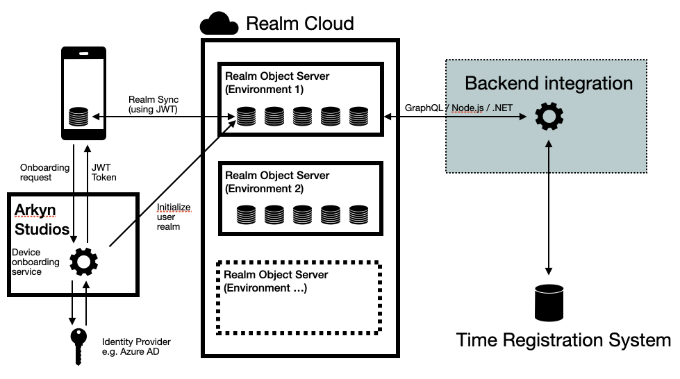
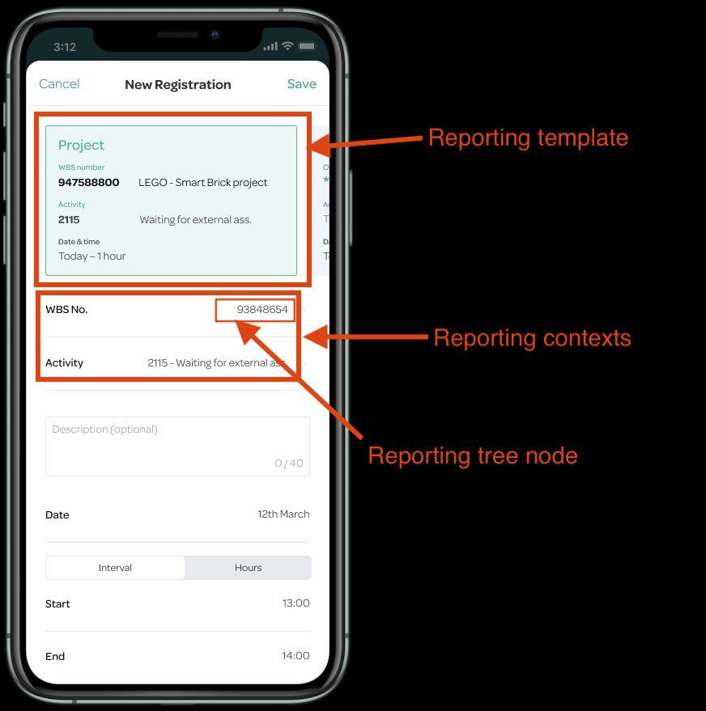
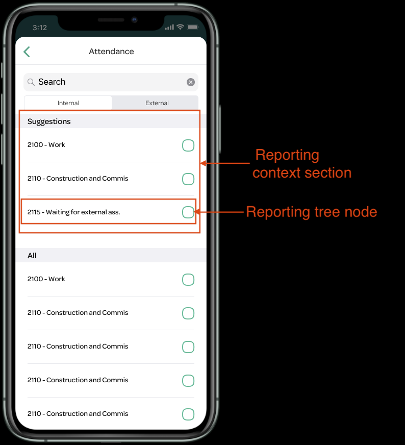

# Arkyn Time - Realm Integration
This repository contains information about the iOS-app Arkyn Time and how to write an integration for a custom backend through the synced Realm-database on the device.
## Overview
Arkyn Time is the first app from Arkyn Studios - a startup focused on creating "consumer grade" apps within the Smart Enterprise space i.e. apps built for large coorporations (primarily with SAP backends).
## System Design
The system has been designed with a couple goals in mind:
- The device must not be waiting on the backend for long-running queries, commands, etc. All actions on the device must be close instantaneous in order to provide a responsive interface.
- It should be easy to write integrations to other backends than SAP.
- When using SAP backends the system should be easy to configure and get up and running quick - without the need for extensive integration projects.

To accomodate these goals Realm is used as the database on the device and Realm Cloud to keep the on-device database synced with the backend.

Apart from Realm a service for onboarding users and authentication is provided by Arkyn Studios.



### Terminology
* "Device" - The device of the end-user. At the moment this will be an iPhone.
* "Backend" - Refers to the time registration backend e.g. SAP, Navision, e-conomic, etc.
* "Backend integration" - Refers to the service responsible for integrating the backend with Arkyn Time i.e. the piece of software this document is intended for helping writing.
* "Realm" - Both refers to the technology/company Realm and the concept "a realm". A realm is a small portable database. Please refer to Realm's documentation for further information about what Realm is.

## Data Model
Most time registration systems are built around the same concept: employees make a registration on a day - either with a start- and end-time or with a fixed amount of time. Then they choose what the registration is related to - that could be a project, an order number, etc. We call this part of the registration `reporting`.

Since different time registration systems have slight variances in how this is done the data model for the app is designed in a backend-agnostic manner with the notion of `reporting trees`. Examples of such reporting trees could be:
- Order No.
- Work breakdown structures (WBS)
- Customers
- Project
- Phases
- Activities
- Kind - Billable, not billable, overtime, etc.
- ... and many other

Many of these will only be lists (trees with depth 1), but they can have any depth required.

A `reporting` is then defined as a selection of `reporting tree nodes` identifying which elements from each tree to register the entry on. An entry can be created based on a `reporting template` that defines which trees to use in a registration. That is done by defining a list of `reporting contexts`. Examples of reporting templates could be: "Project", "Absence", "Leave".



In the above example the template defines two reporting contexts: WBS-number and activity. The finished reporting on the time entry is (in this case) `[947588800, 2115]` (Please note that in practice these will be uuids identifying each node and not their backend IDs as shown here fore the sake of simplicity).

Each reporting tree context can have a number of `reporting tree context sections`. This is a way to provide multiple ways to show the same data - for example by having a section with suggestions (generated by the backend) and a section with all elements.



The backend integration must provide these trees, contexts, sections and templates in the device database - preferable tailored to the individual user to create a better user experience. See examples further down.

### Time entries
A `TimeEntry` is the main entity representing a time entry for the user. It has a number of fields (please refer to the GraphQL api to see all properties as they are subject to change at the moment). The most important ones are:
* `id` (string) - this is a UUID that is generated when the entity is created (wether on the device or the backend integration).
* `backendId` (string?) - a nullable field containing the id of the entry once created in the backend. The backend integration is responsible for writing this
* `status` (string) - Current status of the entity (e.g. `submitted`, `released`, `rejected`).
* `statusLog` (`TimeEntryStatus[]`) - A list of statuses this time entry has been through along with a relevant message (e.g. for invalid or rejected entries). The status with the most recent timestamp should also be the current status.
* `text` (string?) - An optional title for the entry
* `reportingTemplate` (`ReportingTemplate`) - The reporting template used for the time entry
* `reporting` (string[]) - A list of UUIDs of the nodes this entry should registered on.
* `timeType` (string) - Can be `interval` or `duration`
* `entryDate` (date) - Date of entry
* `startTime` (datetime?) - If `timeType` is `interval`
* `endTime` (datetime?) - If `timeType` is `interval`
* `duration` (float) - If `timeType` is `duration`
* `createdOn` (date) - Date the entry was first created

#### Time entry statuses
A time entry will go through any number of statuses. At the moment these are (more may come with time):
```
┌──────────────┐    ┌─────────┐    ┌───────────┐    ┌───────────┐    ┌──────────┐    ┌────────────┐    ┌──────────┐    ┌──────────┐
│ (suggestion) │ -> │ (draft) │ -> │ submitted │ -> │ (invalid) │ -> │ released │ -> │ (rejected) │ -> │ approved │ -> │ recorded │
└──────────────┘    └─────────┘    └───────────┘    └───────────┘    └──────────┘    └────────────┘    └──────────┘    └──────────┘
```
Statuses written in parentheses are optional on an SAP backend. In theory all statuses are optional, so it's up to the backend integration to enforce which are mandatory. 

* `suggestion` - Indicates that this entry is a suggestion generated for the user. This can both be done on the device and from the backend integration.
* `draft` - This time entry has been created on the device but has not yet been submitted to the backend for validation. This status is set by the device.
* `submitted` - The time entry has been submitted to the backend integration, but has not yet been written to the actual time registration backend. This status is written by the backend integration.
* `invalid` - The time entry cannot be written to the time registration backend. This can happen for many different reasons - the most common case being mandatory fields are missing. This status is written by the backend integration.
* `released` - The time entry has been written to the time registration backend and has been released for approval. This status is written by the backend integration.
* `rejected` - The time entry has been rejected by an approver. This status is written by the backend integration.
* `approved` - The time entry has been approved. This status is written by the backend integration.
* `recorded` - The time entry has been recorded in the bookkeeping processes of the backend and is closed for further editing. This status is written by the backend integration.

All statuses may not be relevant for all time registrations backends - in that case the backend integration will just skip the irrelevant statuses.

## Onboarding A New Device
This sections outlines what happens when the user opens the app for the first time.

1. The first time a user opens the app they are prompted for their mail-address which is posted to the Arkyn API. The API looks up which environment the user is associated with and triggers sends back the login-url for this environment along with a unique session-id for a websocket session.
2. This triggers the initialization of a new realm in Realm Cloud (if one does not already exist)
3. First the device must open the websocket connection, and then open the login-url at the Identity Provider (IdP) in a browser. This triggers an Oauth 2.0 code-flow.
4. The users logs in on the identity-provider, and a callback is called at the Arkyn API. The API then requests a token with the given code, and sends that token to the device on the open websocket.
5. Meanwhile the backend integration can initialize data in the user realm. When that is done a flag is set that the database is initialized and a message is sent to the device that all data is ready.

Happy path scenario for first time users:
```
     ┌─────────┐                            ┌────────────┐              ┌────────────┐           ┌─────────────┐               ┌─────────────────────┐
     │ App     │                            │ Arkyn API  │              │ IdP        │           │ Realm Cloud │               │ Backend integration │
     └────┬────┘                            └────┬───────┘              └────┬───────┘           └─────┬───────┘               └──────────┬──────────┘
          │     POST /register_device            ╎                           ╎  Initialize user realm  ╎                                  ╎
          ╎────────────────────────────────────> ║───────────────────────────────────────────────────> ╎  Detect change: new user realm   ╎
          ╎                                      ║                           ╎                         ╎┄┄┄┄┄┄┄┄┄┄┄┄┄┄┄┄┄┄┄┄┄┄┄┄┄┄┄┄┄┄┄┄> ║ 
          ╎ <────────────────────────────────────╜                           ╎                         ╎                                  ║
          ╎     Response:                        ╎                           ╎                         ╎                                  ║
          ╎        login_url                     ╎                           ╎                         ╎                                  ║
          ╎        session_id                    ╎                           ╎                         ╎                                  ║
          ╎                                      ╎                           ╎                         ╎                                  ║
          ╎     Initiate WS with session id      ╎                           ╎                         ╎                                  ║
          ║────────────────────────────────────> ║       GET /authorize      ╎                         ╎                                  ║
          ║────────────────────────────────────────────────────────────────> ║                         ╎                                  ║
          ║                                      ║  Callback with auth code  ║                         ╎                                  ║
          ║                                      ║  <┄┄┄┄┄┄┄┄┄┄┄┄┄┄┄┄┄┄┄┄┄┄┄┄╜                         ╎                                  ║
          ║                                      ║       POST /token         ╎                         ╎                                  ║
          ║                                      ║─────────────────────────> ║                         ╎                                  ║
          ║                                      ║      Response: token      ║                         ╎                                  ║
          ║                                      ║  <────────────────────────╜                         ╎                                  ║
┌╌╌╌╌╌┬╌╌╌╫╌╌╌╌╌╌╌╌╌╌╌╌╌╌╌╌╌╌╌╌╌╌╌╌╌╌╌╌╌╌╌╌╌╌╌╌╌╌╫╌╌╌╌┐                      ╎                         ╎                                  ║
╎ *   ╎   ║                                      ║    ╎                      ╎                         ╎                                  ║
├╌╌╌╌╌┘   ║ <┄┄┄┄┄┄┄┄┄┄┄┄┄┄┄┄┄┄┄┄┄┄┄┄┄┄┄┄┄┄┄┄┄┄┄┄╢    ╎                      ╎                         ╎                                  ║
╎         ║ Upon token: Send JWT token to device ║    ╎                      ╎                         ╎                                  ║
╎         ║                                      ║    ╎                      ╎                         ╎                                  ║
└╌╌╌╌╌╌╌╌╌╫╌╌╌╌╌╌╌╌╌╌╌╌╌╌╌╌╌╌╌╌╌╌╌╌╌╌╌╌╌╌╌╌╌╌╌╌╌╌╫╌╌╌╌┘                      ╎                         ╎                                  ║
          ║                                      ║                           ╎                         ╎                                  ║
┌╌╌╌╌╌┬╌╌╌╫╌╌╌╌╌╌╌╌╌╌╌╌╌╌╌╌╌╌╌╌╌╌╌╌╌╌╌╌╌╌╌╌╌╌╌╌╌╌╫╌╌╌╌┐                      ╎                         ╎                                  ║
╎ *   ╎   ║                                      ║    ╎                      ╎                         ╎                                  ║
├╌╌╌╌╌┘   ║ <┄┄┄┄┄┄┄┄┄┄┄┄┄┄┄┄┄┄┄┄┄┄┄┄┄┄┄┄┄┄┄┄┄┄┄┄╢    ╎                      ╎                         ╎                                  ║
╎         ║ Event: Realm initialized             ║    ╎                      ╎                         ╎                                  ║
╎         ║ Payload: Realm path                  ║    ╎                      ╎                         ╎                                  ║
└╌╌╌╌╌╌╌╌╌╫╌╌╌╌╌╌╌╌╌╌╌╌╌╌╌╌╌╌╌╌╌╌╌╌╌╌╌╌╌╌╌╌╌╌╌╌╌╌╫╌╌╌╌┘                      ╎                         ╎    Write user data done          ║
          ║                                      ║      Detect change        ╎                         ╎  <───────────────────────────────╜
┌╌╌╌╌╌┬╌╌╌╫╌╌╌╌╌╌╌╌╌╌╌╌╌╌╌╌╌╌╌╌╌╌╌╌╌╌╌╌╌╌╌╌╌╌╌╌╌╌╫╌╌╌╌┐ Write user data done ╎                         ╎                                  ╎
╎ *   ╎   ║                                      ║ <┄┄┄┄┄┄┄┄┄┄┄┄┄┄┄┄┄┄┄┄┄┄┄┄┄┄┄┄┄┄┄┄┄┄┄┄┄┄┄┄┄┄┄┄┄┄┄┄┄┄┄╎                                  ╎
├╌╌╌╌╌┘   ║ <┄┄┄┄┄┄┄┄┄┄┄┄┄┄┄┄┄┄┄┄┄┄┄┄┄┄┄┄┄┄┄┄┄┄┄┄╢    ╎                      ╎                         ╎                                  ╎
╎         ║ Event: Data ready                    ║    ╎                      ╎                         ╎                                  ╎
╎         ║                                      ║    ╎                      ╎                         ╎                                  ╎
└╌╌╌╌╌╌╌╌╌╫╌╌╌╌╌╌╌╌╌╌╌╌╌╌╌╌╌╌╌╌╌╌╌╌╌╌╌╌╌╌╌╌╌╌╌╌╌╌╫╌╌╌╌┘                      ╎                         ╎                                  ╎

```

## Integration

### Authentication
*TBD! This is not ready yet, and may be subject to change, so please wait before doing this step*

Authentication from the device towards Realm Cloud is done with a JWT-token issued by some identity-provider (e.g. Azure AD) with an authorization code flow initialized during the device onboarding. 

Realm will use the public key for that provider to verify the token and user identity.

Please use this guide to register an application:
https://docs.microsoft.com/en-us/azure/active-directory/develop/quickstart-register-app

The redirect-url to use is https://api.arkynstudios.com/auth_callback (TBD)

### Backend Integration
The backend must connect to the Realm Cloud Platform and manipulate the data in the individual users' realms. A "realm" is an individual database in Realm terminology. Each device will have a separate realm containing the data relevant for that user. Realms are identified by a path (e.g. `/users/{user-id}`).

This can be done with GraphQL: https://docs.realm.io/sync/graphql-web-access/how-to-use-the-api

Alternatively theres a Node.js or .NET SDK.
Information regarding this, can be found here: https://docs.realm.io/sync/backend-integration/data-integration

Connections are obtained using username / password credentials supplied by Arkyn.

The backend integration has three main responsibilities (at the moment - more may come).

#### Responsibility #1: Initialize device database
The backend integration must subscribe to changes in the realm `/users` on the entity `Realms`. When new users are onboarded (see the section about onboarding new users) a new entity is added to this table. The entity contains information about the user ID (the email address) and the path to the realm of that users.

When that happens the backend integration must generate the following data in the users' realm:
1. Reporting data (see section Data Model for elaboration)
    1. Reporting trees
    2. Reporting sections
    3. Reporting contexts
    4. Reporting templates
2. Existing time entries (for relevant period of time backwards)

After this process is done the flag `is_initialized` must be set to `true` on the `Realms`-entity.

Please note, that the main focus should be on the usability for the user - that means that all data should be filtered from the users' perspective i.e. projects that are not relevant/open for the user to report on shouldn't be added. When possible a "suggestions" section should be added to a reporting context, giving the user sensible choices.

#### Responsibility #2: Keep database in sync with backend
When changes happens in the backend these must be reflected in the users' database. That could be when new customers and/or projects are added, old projects are deleted, etc.

Also it is important to keep time entries in sync, meaning that if new entries are created elsewhere and/or the status of entries change, this should of course be reflected in the users' realm.

#### Responsibility #3: Submit new timeentries from the device to the backend
When the user creates a new time entry on the device the backend integration must submit it to the backend.

In order to do so the reporting nodes must be resolved in order to figure out where to register the time.

If the time entry is invalid (either missing mandatory fields and/or other error messages from the backend), the time entry's status must be set to "invalid" along with a list of messages describing this/these error(s) (using the `statusLog` field).

If the time entry is successfully committed to the backend the entry should recieve the status `released`. Please make sure that the entry is indeed released for approval in the backend.

## Examples

###